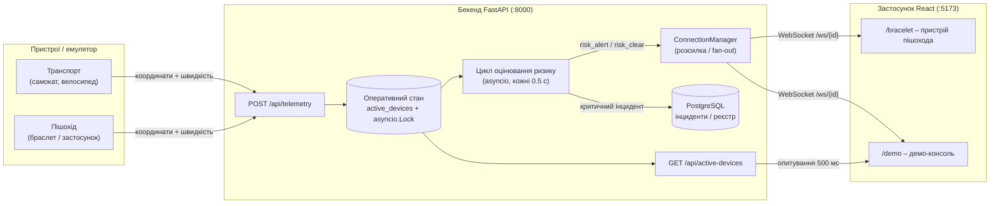
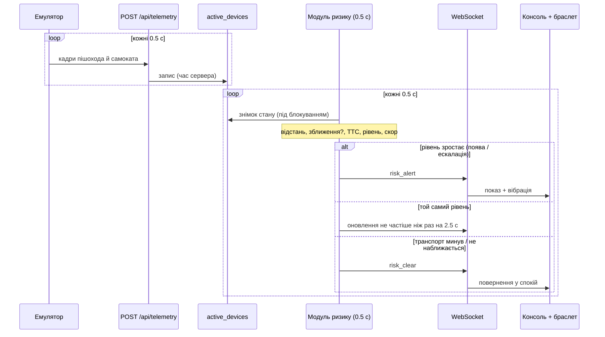
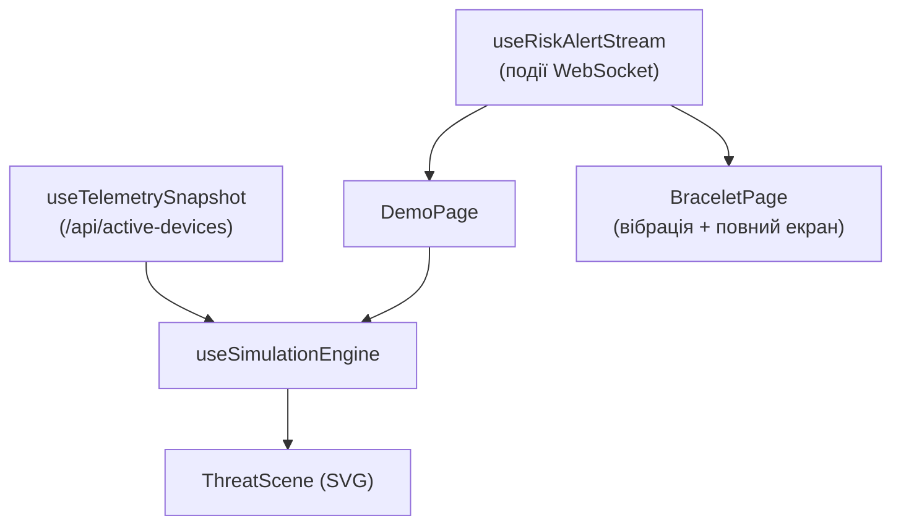

# VARTA – архітектура

Документ описує, як побудована система VARTA, як дані проходять через неї в реальному часі та які технічні рішення покладено в основу. Алгоритм оцінювання ризику детально розглянуто в [`RISK_ENGINE.md`](./RISK_ENGINE.md), а локальний запуск і демонстрацію – у [`DEMO.md`](./DEMO.md).

---

## 1. Загальний огляд

VARTA – це конвеєр реального часу (real-time pipeline) за принципом **приймання → оцінювання → передавання** (ingest → reason → push), доповнений окремим каналом даних для візуалізації.



До демо-консолі свідомо ведуть два незалежні потоки даних:

1. **Потік подій (WebSocket)** – _рішення_ модуля ризику: рівень небезпеки, напрямок, ризик-скор (risk score) і причина. Він керує карткою активної загрози та інтерфейсом пішохода.
2. **Потік знімків (polling / опитування)** – _фактичні координати_ всіх об'єктів. Демо-консоль опитує `GET /api/active-devices` і за цими даними анімує сцену.

Розділення цих потоків – ключове рішення. Дискретні змістовні події не змішуються з безперервним оновленням позицій, тому візуалізація лишається стабільною, а логіка попереджень – передбачуваною.

---

## 2. Потік даних одного епізоду

- Емулятор (або реальний пристрій) щопів секунди надсилає кадри телеметрії пішохода й транспорту.
- Сервер записує їх у `active_devices`, проставляючи власний час отримання.
- Модуль ризику читає знімок стану під блокуванням, для кожної пари обчислює відстань, факт зближення, час до конфлікту (TTC) і рівень небезпеки.
- Під час появи загрози або зростання рівня надсилається `risk_alert`; той самий рівень оновлюється з обмеженою частотою; після завершення епізоду надсилається один `risk_clear`.
- Пристрій пішохода показує стан і вмикає вібрацію, демо-консоль оновлює картку загрози та стрічку подій.



---

## 3. Основні компоненти

### 3.1 Приймання телеметрії – `POST /api/telemetry` (`main.py`)

Кожен пристрій надсилає невеликий JSON-кадр, валідований `TelemetryInput` (`schemas.py`):

```json
{
  "device_id": "scooter_1",
  "is_pedestrian": false,
  "lat": 50.4503,
  "lon": 30.5234,
  "speed": 3.0,
  "azimuth": 180.0
}
```

Час `last_updated` проставляється **на сервері**, а не клієнтом, щоб уникнути розбіжності годинників між пристроями. Далі кадр записується у спільний словник `active_devices` під `state_lock`. На цьому кроці немає жодних обчислень ризику – приймання лишається швидким і простим.

### 3.2 Оперативний стан – `state.py`

`active_devices` (звичайний `dict`) разом із `state_lock = asyncio.Lock()` утворюють «поточний світ». Оскільки FastAPI працює на одному циклі подій (event loop) asyncio, для узгодженості читань і записів достатньо асинхронного блокування без потоків.

### 3.3 Модуль оцінювання ризику – `risk_engine.py`

Фонова корутина, запущена в `lifespan` застосунку. Кожні **0.5 с** вона бере знімок стану, формує всі пари «пішохід × транспорт», оцінює кожну й вирішує, що надіслати: `risk_alert`, `risk_clear` чи нічого. Це серце системи, повністю описане в [`RISK_ENGINE.md`](./RISK_ENGINE.md).

### 3.4 Канал подій – `connection_manager.py` + `/ws/{client_id}`

`ConnectionManager` зберігає **список сокетів на кожен `client_id`** (`dict[str, list[WebSocket]]`). Це важливо: під час демо той самий пішохід (`pedestrian_1`) відкритий одразу в кількох місцях – демо-консоль, сторінка браслета та слухач емулятора. Менеджер з одним сокетом на клієнта передавав би події лише останньому підключенню. Розсилка (fan-out) доставляє кожну подію всім сесіям і прибирає «мертві» сокети після помилки надсилання.

### 3.5 Поточний знімок сцени – `GET /api/active-devices`

Повертає поточний стан `active_devices`. Демо-консоль опитує його кожні 500 мс, щоб анімувати позиції об'єктів. Це навмисно проста read-model без будь-якої логіки ризику – лише «де зараз усі перебувають».

### 3.6 Довготривале сховище – PostgreSQL (`db.py`, `models.py`, `seed.py`)

Асинхронний SQLAlchemy поверх `asyncpg`. Таблиці: `users`, `devices`, `vehicles`, `incidents`. На старті застосунок створює таблиці (`create_all`) і засіває `pedestrian_1` та `scooter_1`, щоб ідентифікатори з емулятора існували в базі. Модуль ризику записує рядок `Incident` один раз за епізод, коли пара вперше досягає рівня **critical** – це основа для майбутньої карти небезпечних зближень.

---

## 4. Контракти подій (`schemas.py`)

Межа між бекендом і фронтендом – невелика версіонована (versioned) дискримінована спілка (discriminated union). Фронтенд не вгадує структуру, а зіставляє поле `type`.

### `risk_alert`

```jsonc
{
  "type": "risk_alert",
  "version": 1,
  "timestamp": "2026-07-02T18:00:00Z",
  "deviceId": "pedestrian_1", // кому призначене попередження
  "vehicleId": "scooter_1", // джерело загрози
  "severity": "warning", // safe | caution | warning | critical
  "riskScore": 72, // шкала 0–100, узгоджена з рівнем небезпеки
  "message": "УВАГА! Транспорт наближається спереду (13 м)",
  "direction": "front", // відносно напрямку руху пішохода
  "distanceMeters": 13.4,
  "timeToConflictSeconds": 3.9, // null, якщо транспорт не наближається
  "vehicleType": "scooter",
  "speedKmh": 10.8,
  "reason": "Транспорт наближається спереду; відстань 13.4 м; швидкість 10.8 км/год",
  "vibrationPattern": [140, 90, 140],
}
```

### `risk_clear`

```jsonc
{
  "type": "risk_clear",
  "version": 1,
  "timestamp": "2026-07-02T18:00:11Z",
  "deviceId": "pedestrian_1",
  "vehicleId": "scooter_1",
  "reason": "Загроза минула",
}
```

Версіонований самоописовий контракт розділяє дві частини команди, дозволяє консолі й браслету використовувати один парсер, а поля `reason` і `message` лишаються людиночитними. Поле `version` дає простір для розвитку без поломки наявних клієнтів.

---

## 5. Frontend (`frontend/src`)

### Маршрутизація (`app/App.tsx`)

Навмисно без бібліотеки-роутера: `/` та `/demo` → демо-консоль, `/bracelet` → пристрій пішохода, `/bracelet-preview` → той самий інтерфейс у корпусі пристрою для відеодемонстрації.

### Потік реального часу (`features/realtime`)

- **`useRiskAlertStream`** – володіє WebSocket-з'єднанням: підключення, автоматичне перепідключення (auto-reconnect), парсинг подій, зберігання `latestAlert` та обмеженої історії `alertHistory`. Подію `risk_clear` обробляє окремо: очищає активну загрозу лише тоді, коли її `vehicleId` збігається з поточним, і не додає очищення в історію.
- **`useTelemetrySnapshot`** – опитує `/api/active-devices` кожні 500 мс у типізований масив пристроїв.

Сторінки `/demo` і `/bracelet` використовують `useRiskAlertStream`, тому реагують на один і той самий потік подій – це і забезпечує синхронність.

### Візуалізація (`features/simulation`)

- **`useSimulationEngine`** – перетворює телеметрію на екранних акторів. Рух походить **лише з телеметрії**; події ризику акторів не рухають, а лише додають підсвічування. Перша позиція пішохода стає світовим якорем (world anchor), усі об'єкти проєктуються в метрах відносно нього, тому камера не «стрибає» під час зміни координат. Згладжування (smoothing) плавно веде акторів до цільової позиції.
- **`ThreatScene`** – SVG-сцена поточного знімка: пішохід (зелений) із кільцем безпечної зони, основна загроза (червоний) зі слідом руху та лінією напрямку загрози, до двох найближчих другорядних транспортних засобів, лічильник іншого руху та легенда.



---

## 6. Технічні рішення та обґрунтування

| Рішення                                          | Чому саме так                                                                                                                           |
| ------------------------------------------------ | --------------------------------------------------------------------------------------------------------------------------------------- |
| **FastAPI + asyncio**                            | Один цикл подій обслуговує багато WebSocket-з'єднань і періодичний цикл ризику без потоків та складних блокувань; асинхронна БД.        |
| **Оперативний стан у пам'яті (in-memory state)** | Рішення про ризик потребують _останньої_ позиції з субсекундною частотою; звернення до словника швидше за запит до БД.                  |
| **Push через WebSocket (server push)**           | Попередження про небезпеку мають бути миттєвими й ініційованими сервером; опитування з телефону додавало б затримку та витрату батареї. |
| **Розділення потоків подій і знімків**           | Дозволяє _рішенню_ (дискретному й змістовному) та _анімації_ (безперервній і косметичній) розвиватися незалежно й лишатися стабільними. |
| **Версіоновані дискриміновані події**            | Спільний контракт, один парсер для консолі й браслета, людиночитні поля.                                                                |
| **React + Vite + Tailwind, SVG-сцена**           | Швидка розробка без важких залежностей для анімації; чітке відображення за будь-якого розміру екрана.                                   |
| **Емулятор замість обладнання**                  | Відтворюваний і керований сценарій без GPS-пристроїв; реальний пристрій надсилав би такий самий кадр телеметрії.                        |

---

## 7. Межі поточної реалізації

- **Один процес, стан у пам'яті** – горизонтального масштабування ще немає, стан втрачається при перезапуску. Для демо цього достатньо; у продакшені (production) його замінює спільне сховище чи потокова обробка (streaming).
- **Планарна геометрія** – відстань рахується за формулою гаверсинуса, а напрямок і сцена використовують локальне пласке наближення, коректне в міському масштабі.
- **Спрощений TTC** – евристика за швидкістю зближення, а не повний розрахунок перетину траєкторій.
- **`create_all` замість міграцій** – спрощення для MVP; для продакшену – Alembic.

Як кожне з цих обмежень стає повноцінною можливістю, описано в розділі траєкторії розвитку [`DEMO.md`](./DEMO.md).
