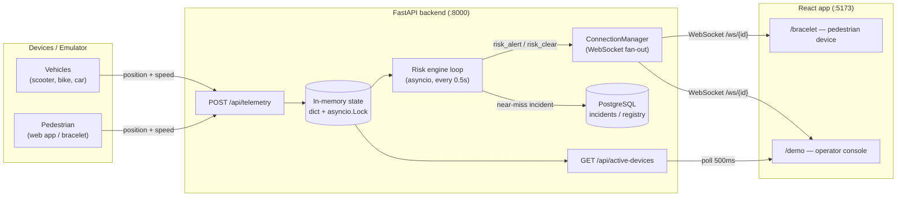
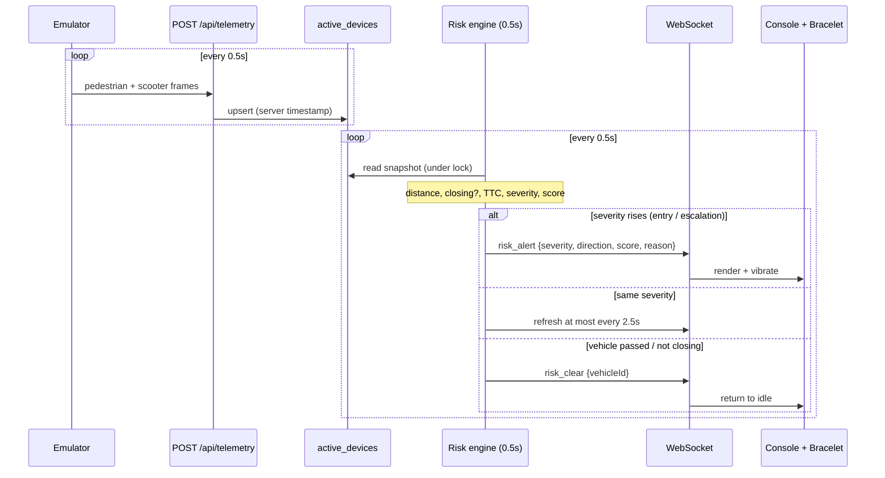
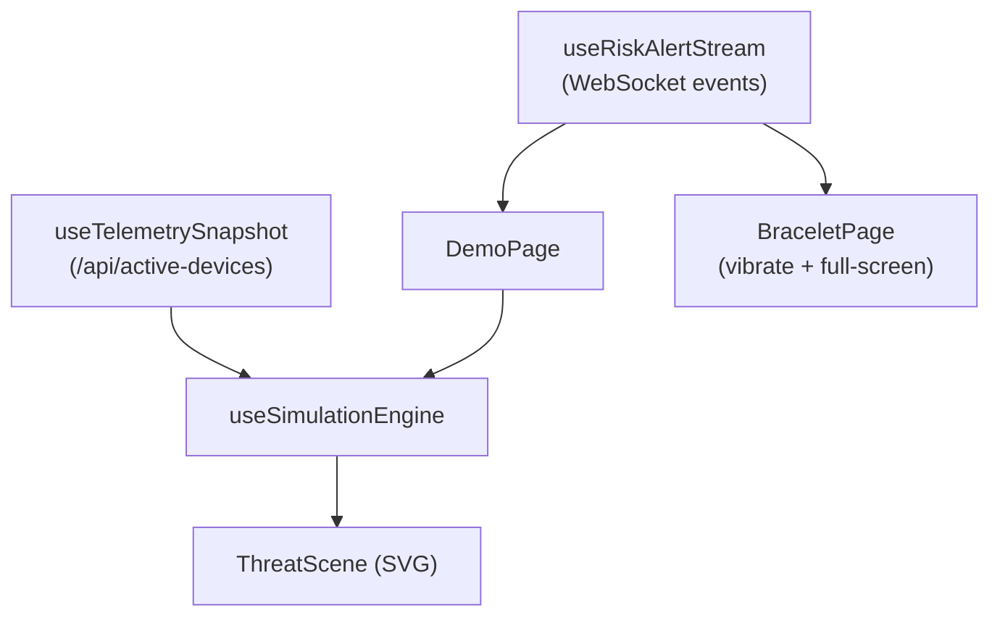

# VARTA — Architecture

This document explains how VARTA is built, how data flows through it in real time,
and _why_ each major decision was made. The companion [`RISK_ENGINE.md`](./RISK_ENGINE.md)
drills into the scoring algorithm; [`DEMO.md`](./DEMO.md) covers running and presenting it.

---

## 1. System overview

VARTA is a classic real-time pipeline: **ingest → reason → push**, with a lightweight
read-model for visualization.



Two independent data paths reach the console on purpose:

1. **Event path (WebSocket)** — _what the risk engine decided_: severity, direction,
   score, reason. This drives the alert card and the pedestrian bracelet.
2. **Snapshot path (polling)** — _where everything physically is_: raw positions used
   to animate the map. Keeping these separate is the key architectural decision behind
   a stable, non-jittery visualization (see §5).

---

## 2. Components

### 2.1 Ingestion — `POST /api/telemetry` (`main.py`)

Every device (real or emulated) posts a small JSON frame validated by
`TelemetryInput` (`schemas.py`):

```json
{
  "device_id": "scooter_1",
  "is_pedestrian": false,
  "lat": 50.4503,
  "lon": 30.5234,
  "speed": 3.0,
  "azimuth": 180.0
}
```

The server stamps `last_updated` **on the server** (not the client) to avoid clock
skew between devices, then writes the frame into the shared `active_devices` dict under
`state_lock`. Ingestion does no risk math — it stays fast and dumb.

### 2.2 Hot state — `state.py`

```python
active_devices: dict = {}      # device_id -> {lat, lon, speed, azimuth, is_pedestrian, last_updated}
state_lock = asyncio.Lock()
```

A single process-wide dict is the "current world". Because FastAPI runs on one asyncio
event loop, an `asyncio.Lock` is enough to keep reads/writes consistent without threads.

### 2.3 Risk engine — `risk_engine.py`

A background coroutine started in the FastAPI `lifespan`. Every **0.5 s** it snapshots
the state, forms every `pedestrian × vehicle` pair, scores each pair, and applies an
emission policy that decides whether to send a `risk_alert`, a `risk_clear`, or stay
silent. This is the heart of the product — fully documented in
[`RISK_ENGINE.md`](./RISK_ENGINE.md).

### 2.4 Push channel — `connection_manager.py` + `/ws/{client_id}`

`ConnectionManager` stores **a list of sockets per `client_id`**:

```python
active_connections: dict[str, list[WebSocket]]
```

This matters: during a demo the same pedestrian (`pedestrian_1`) is open in several
tabs at once — the console, the bracelet, and the emulator's listener. A single-socket
manager would only feed the last one to connect. Fan-out broadcasts each event to all
of them and prunes dead sockets on send failure.

### 2.5 Live snapshot — `GET /api/active-devices`

Returns the current `active_devices` as `ActiveDevicesResponse`. The console polls this
every 500 ms to animate actor positions. It's a deliberately simple read-model — no
risk logic, just "where is everyone right now".

### 2.6 Cold storage — PostgreSQL (`db.py`, `models.py`, `seed.py`)

Async SQLAlchemy over `asyncpg`. Tables: `users`, `devices`, `vehicles`, `incidents`.
On startup the app creates tables (`create_all`, MVP shortcut for Alembic) and seeds
`pedestrian_1` + `scooter_1` so the emulator's IDs resolve. The risk engine writes an
`Incident` row once per episode when a pair first reaches **critical** — this is the
seed of a future near-miss heatmap.

---

## 3. Real-time sequence (one near-miss)



---

## 4. Event contracts (`schemas.py`)

The backend↔frontend boundary is a small, versioned, discriminated union. The frontend
never guesses — it matches on `type`.

### `risk_alert`

```jsonc
{
  "type": "risk_alert",
  "version": 1,
  "timestamp": "2026-07-02T18:00:00Z",
  "deviceId": "pedestrian_1", // who the alert is FOR
  "vehicleId": "scooter_1", // the threat
  "severity": "warning", // safe | caution | warning | critical
  "riskScore": 72, // 0–100 gauge, consistent with severity band
  "message": "УВАГА! Транспорт наближається спереду (13 м)",
  "direction": "front", // relative to the pedestrian's heading
  "distanceMeters": 13.4,
  "timeToConflictSeconds": 3.9, // null if not closing
  "vehicleType": "scooter",
  "speedKmh": 10.8,
  "reason": "Vehicle approaching from front; distance 13.4m; speed 10.8 km/h; ...",
  "vibrationPattern": [140, 90, 140],
}
```

### `risk_clear`

```jsonc
{
  "type": "risk_clear",
  "version": 1,
  "timestamp": "2026-07-02T18:00:11Z",
  "deviceId": "pedestrian_1",
  "vehicleId": "scooter_1",
  "reason": "Vehicle no longer closing / left the risk zone.",
}
```

**Why a versioned, self-describing contract?** It decouples the two halves of the team,
lets the bracelet and console share one parser, and makes the payload demo-explainable
(`reason` and `message` are human-readable). `version` leaves room to evolve without
breaking older clients.

---

## 5. Frontend design (`frontend/src`)

### Routing (`app/App.tsx`)

Deliberately dependency-free path routing (no router library):
`/` and `/demo` → console, `/bracelet` → pedestrian device, `/bracelet-preview` →
video-friendly variant.

### Real-time hooks (`features/realtime`)

- **`useRiskAlertStream`** — owns the WebSocket: connect, auto-reconnect with backoff,
  parse each message, keep `latestAlert` + a bounded `alertHistory`. It handles
  `risk_clear` specially: it clears the active alert **only if** the cleared `vehicleId`
  matches the one on screen, and does **not** push clears into the history feed.
- **`useTelemetrySnapshot`** — polls `/api/active-devices` every 500 ms into a typed
  `TelemetryDeviceSnapshot[]`.

Both `/demo` and `/bracelet` reuse `useRiskAlertStream`, guaranteeing they react to the
exact same event stream — which is the whole point of the "synchronized alert" demo.

### Simulation (`features/simulation`)

- **`useSimulationEngine`** — converts raw telemetry into on-screen `actors`.
  - **Motion comes only from telemetry.** Alerts never move actors; they only decorate
    (severity glow, primary-threat highlight). This separation killed an earlier class
    of "the scene fights itself" jitter bugs.
  - **Pedestrian-anchored projection.** The first pedestrian fix becomes a world anchor;
    everyone is projected in metres relative to it (`METERS_TO_SCENE`), so the camera
    doesn't rubber-band as GPS values change.
  - **Adaptive smoothing** (`lerpAdaptive`) eases actors toward their telemetry target
    and snaps when very close, avoiding both lag and micro-oscillation.
- **`ThreatScene`** — pure SVG/Tailwind render of the snapshot: pedestrian (green),
  primary threat (red) with its trail and threat vector, up to 2 nearest secondary
  vehicles (orange) plus an "other traffic (+N)" counter, a live directional badge, and
  a TTC readout. No animation library.



---

## 6. Technology choices & rationale

| Decision                                | Why                                                                                                                                             |
| --------------------------------------- | ----------------------------------------------------------------------------------------------------------------------------------------------- |
| **FastAPI + asyncio**                   | One event loop cleanly handles many WebSockets + a periodic risk loop. No thread/lock complexity; native async DB.                              |
| **In-memory hot state**                 | Risk decisions need the _latest_ position at sub-second cadence. A dict lookup beats a DB round-trip; Postgres is reserved for cold/audit data. |
| **WebSocket push (not client polling)** | Safety alerts must be immediate and server-initiated. Polling from a phone every second wastes battery and adds latency.                        |
| **Split event vs. snapshot paths**      | Lets the _decision_ (discrete, meaningful) and the _animation_ (continuous, cosmetic) evolve independently and stay visually stable.            |
| **Versioned discriminated events**      | Shared, future-proof contract; one parser for console + bracelet; human-readable for the demo.                                                  |
| **React + Vite + Tailwind, SVG scene**  | Fast iteration, no heavy game/animation deps, crisp on a projector.                                                                             |
| **Emulator instead of hardware**        | Reproducible, tunable, narratable demo without GPS units.                                                                                       |

---

## 7. Known limits (honest, and intentional for an MVP)

- **Single-process, in-memory state** — no horizontal scaling yet; state is lost on
  restart. Fine for a demo, replaced by Redis/streaming in production (see roadmap).
- **Planar geometry** — distance uses the haversine formula, but direction/scene use a
  local flat-earth approximation, valid at city scale.
- **Simplified TTC** — a closing-speed heuristic, not full trajectory intersection.
- **`create_all` instead of migrations** — MVP shortcut; Alembic for production.

See [`DEMO.md`](./DEMO.md#8-roadmap--production-path) for how each of these becomes a
production feature.
