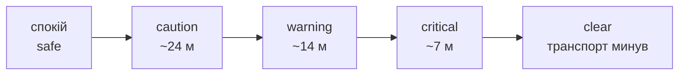

# VARTA – запуск і демонстрація

Документ описує, як запустити VARTA локально, відтворити демонстраційний сценарій і як тлумачити побачене. Архітектуру й алгоритм детально розглянуто в [`ARCHITECTURE.md`](./ARCHITECTURE.md) та [`RISK_ENGINE.md`](./RISK_ENGINE.md).

---

## 1. Що показує система

Два екрани реагують на той самий потік подій синхронно:

- **`/demo` – демо-консоль оператора:** жива сцена з пішоходом (зелений) у центрі та транспортом, що наближається (червоний) із лінією напрямку загрози; інший рух показано окремо з лічильником. Картка «Активна загроза» містить рівень небезпеки, ризик-скор, відстань, TTC, напрямок і транспорт, а нижче – стрічка останніх подій.
- **`/bracelet` – пристрій пішохода:** повноекранний стан, колір якого зростає зелений → жовтий → помаранчевий → червоний, текст напрямку загрози та **вібрація** з патерном під конкретний рівень.

Типовий епізод проходить шлях **спокій → caution → warning → critical → clear** приблизно за 10 с.

---

## 2. Передумови

- **Docker** (для PostgreSQL).
- **Python 3.11+** з віртуальним середовищем.
- **Node ≥ 22.12** для фронтенду (вимагають Vite 8 / новіший ESLint).

---

## 3. Запуск системи

**Термінал 1 – база даних**

```bash
docker compose up -d
```

**Термінал 2 – бекенд** (з кореня репозиторію)

```bash
python3 -m venv venv
source venv/bin/activate            # Windows: venv\Scripts\activate
pip install -r requirements.txt
uvicorn main:app --reload --port 8000
```

Дочекайтеся повідомлення «База даних успішно ініціалізована!» – на старті також засіваються `pedestrian_1` і `scooter_1` та запускається цикл оцінювання ризику.

**Термінал 3 – фронтенд**

```bash
cd frontend
npm install
npm run dev                          # додайте -- --host 0.0.0.0, щоб відкрити на телефоні
```

**Відкрийте екрани:**

- Консоль → `http://localhost:5173/demo`
- Браслет → `http://localhost:5173/bracelet` (для вібрації відкрийте на телефоні через IP хоста; підійде й друге вікно браузера)

У шапці обох екранів має бути стан **Наживо**.

---

## 4. Запуск сценарію (емулятор)

**Термінал 4 – сценарій руху** (з активним venv, з кореня репозиторію)

```bash
python emulator.py                   # додайте --with-bike для другого транспорту, що перетинає шлях
```

Емулятор надсилає телеметрію пішохода й самоката, що наближаються назустріч, і завершується самостійно після короткої фази стабілізації – без «залишкового тремтіння» об'єктів на сцені. Запускайте команду знову, щоб повторити епізод.

Прапорець `--with-bike` додає другий транспортний засіб, який перетинає траєкторію збоку, – зручно, щоб побачити роботу з кількома об'єктами й вибір основної загрози.

---

## 5. Очікувана поведінка по фазах



| Фаза         | Консоль                                                            | Браслет                                |
| ------------ | ------------------------------------------------------------------ | -------------------------------------- |
| **caution**  | Транспорт з'являється поблизу, картка показує caution і скор 45–64 | жовтий, м'яка вібрація, текст напрямку |
| **warning**  | Рівень зростає одразу, скор 65–84, основну загрозу підсвічено      | помаранчевий, сильніша вібрація        |
| **critical** | Скор 85–100, інцидент записано один раз                            | червоний, найсильніший патерн вібрації |
| **clear**    | Транспорт минув і більше не наближається – один `risk_clear`       | повертається до спокійного стану       |

Ескалація миттєва (зростання ризику не чекає на таймер), а зниження рівня під час наближення приховується. Тож на один епізод припадає рівно одне попередження на кожен рівень плюс одне завершення – без «мерехтіння». Деталі політики – у [`RISK_ENGINE.md`](./RISK_ENGINE.md#6-політика-генерації-подій).

---

## 6. Часті питання

**Це справжній GPS?** Програмний ланцюг реальний повністю – API телеметрії, модуль ризику, WebSocket, інтерфейс. Емулятор замінює обладнання, щоб епізод був відтворюваним; реальний пристрій надсилав би такий самий кадр на `/api/telemetry`.

**Як уникаються хибні спрацювання?** Три фільтри: транспорт має рухатися (> 1.5 м/с), має _наближатися_ (з допуском на похибку) і зниження рівня приховується, тож стан не «мерехтить». Не-загрози не породжують нічого.

**Чи не буде забагато сповіщень?** Ні – політика дає приблизно одне попередження на рівень плюс одне завершення епізоду. Повтори того самого рівня обмежені до одного разу на 2.5 с.

**Чи масштабується це?** Наразі це один процес зі станом у пам'яті (in-memory state) – мала затримка й простота. У продакшені (production) його замінює спільне сховище чи потокова обробка (streaming) з просторовим розподілом пар (spatial sharding). Контракти й логіка ризику при цьому не змінюються.

**Чому напрямок правильний?** Він обчислюється відносно напрямку руху пішохода, а не сторін світу, тож «спереду / позаду / ліворуч / праворуч» означають те, що людина відчуває насправді.

**Як щодо приватності?** Оперативний стан тимчасовий і автоматично зникає через 60 с; зберігаються лише знеособлені критичні епізоди (координати + відстань).

---

## 7. Перевірка працездатності

- [ ] Консоль і браслет показують стан **Наживо**.
- [ ] `GET http://localhost:8000/api/active-devices` повертає пристрої.
- [ ] Запуск емулятора дає послідовність caution → warning → critical → clear на обох екранах.
- [ ] На телефоні увімкнено звук/вібрацію, екран не гасне (для ефекту вібрації).

---

## 8. Траєкторія розвитку

| Поточний MVP                         | Наступні кроки                                                                         |
| ------------------------------------ | -------------------------------------------------------------------------------------- |
| Стан у пам'яті, один процес          | Спільне/потокове сховище (streaming), просторовий розподіл (sharding) оцінювання пар   |
| Телеметрію задає емулятор            | SDK реального пристрою (застосунок + трекер транспорту) з тим самим контрактом         |
| Спрощений TTC за швидкістю зближення | Повний розрахунок перетину траєкторій, контекст карти й смуг руху                      |
| `create_all` на старті               | Міграції (migrations) через Alembic                                                    |
| Критичні епізоди в PostgreSQL        | Міська панель: теплові карти (heatmaps) небезпечних зближень, аналітика для планування |
| Локальний запуск                     | TLS, автентифікація телеметрії та WebSocket, токени пристроїв                          |

---

## 9. Усунення несправностей

| Симптом                                          | Що зробити                                                                                                                |
| ------------------------------------------------ | ------------------------------------------------------------------------------------------------------------------------- |
| Консоль/браслет застрягли на «З'єднання…»        | Бекенд не запущено або неправильний `VITE_WS_URL`. Перевірте, що `uvicorn` працює на порту 8000.                          |
| Емулятор: `ModuleNotFoundError: aiohttp`         | Не активоване venv або не встановлені залежності: `source venv/bin/activate && pip install -r requirements.txt`.          |
| Нічого не відбувається під час запуску емулятора | Переконайтеся, що засіяно `pedestrian_1` (див. лог старту бекенду); клієнтський id браслета має бути `pedestrian_1`.      |
| Телефон не вібрує                                | Вібрація в браузері потребує реального пристрою та дії користувача; колір і патерн на екрані все одно демонструють ефект. |
| Збірка/лінт фронтенду падає на Node 20           | Використовуйте Node ≥ 22.12 (див. `engines` у `frontend/package.json`).                                                   |
