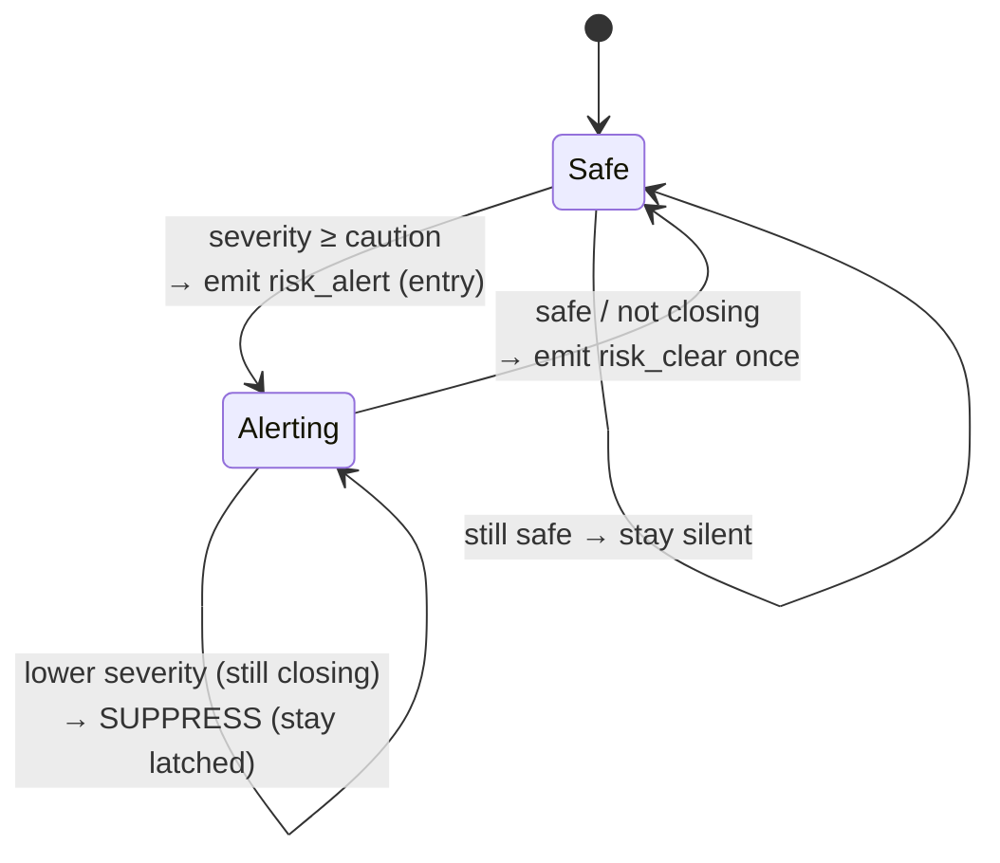

# VARTA — Risk Engine

The risk engine (`risk_engine.py`) is the product's brain. It turns a stream of raw
positions into a small number of **meaningful, non-annoying, explainable** alerts. This
document is the reference for how it decides _what_ to say and _when_ to say it.

Design goals, in priority order:

1. **Correctness of intent** — only warn about vehicles that are genuinely closing in.
2. **Explainability** — every alert carries a human-readable `reason` and a direction.
3. **No alert fatigue** — speak on escalation, stay quiet otherwise, and clean up after.
4. **Perceptible escalation** — transitions between severities are paced so a person has
   time to perceive and react to each step, rather than jumping straight to critical.

---

## 1. The loop

```python
while True:
    snapshot state under lock
    drop devices stale > 60s   (and their pair state)
    for each (pedestrian, vehicle) pair:
        process_pair(...)
    await asyncio.sleep(0.5)
```

Runs every **0.5 s**. Each tick evaluates every pedestrian↔vehicle pair independently.

---

## 2. Per-pair state

Because a real relationship evolves over time, each pair keeps a small memory
(`PairState`), keyed `"<pedestrian_id>__<vehicle_id>"`:

| Field              | Purpose                                                                  |
| ------------------ | ------------------------------------------------------------------------ |
| `last_distance`    | Previous distance — used to detect **closing** vs. receding              |
| `emitted_severity` | The **latched** severity for this episode (never downgraded until clear) |
| `last_emit_time`   | Cooldown anchor for same-severity refreshes                              |
| `critical_logged`  | Ensures a near-miss incident is written to DB **once** per episode       |

When either device goes stale, its pair state is discarded so a new encounter starts clean.

---

## 3. Signals computed each tick

For a pair, from the two latest frames:

- **Distance** — haversine, in metres.
- **Closing?** — `dist < last_distance - 0.3 m`. The `0.3 m` epsilon absorbs GPS
  jitter so we don't flip-flop. **First sighting is never "closing"** (no history yet),
  which prevents a spurious alert on the very first frame.
- **Time-to-conflict (TTC)** — `distance / (vehicle_speed + pedestrian_speed)`, a
  closing-speed heuristic. `null` when not closing.
- **Vehicle speed** — a vehicle must move `> 1.5 m/s` (~5.4 km/h) to count as a threat;
  parked/idling vehicles are ignored.

---

## 4. Severity mapping

Severity is **distance-band–driven** (interpretable, stable), and **escalated by TTC**
so a fast approach trips a higher level earlier than distance alone would.

| Severity   | Trigger (distance **or** TTC)                                 |
| ---------- | ------------------------------------------------------------- |
| `critical` | `dist ≤ 7 m` or `TTC ≤ 1.5 s`                                 |
| `warning`  | `dist ≤ 14 m` or `TTC ≤ 3.0 s`                                |
| `caution`  | `dist ≤ 24 m` or `TTC ≤ 5.0 s`                                |
| `safe`     | everything else, **or** not closing, **or** vehicle < 1.5 m/s |

> Distance bands (not raw score) drive the label because they're easy to reason about,
> easy to tune, and don't wobble frame-to-frame — which keeps the demo legible.

---

## 5. Risk score (the 0–100 gauge)

Severity is the _decision_; the score is a smooth _gauge_ for the UI. It's a weighted
blend of three normalized components:

```
distance_score = clamp(100 · (1 − distance / 28 m))
ttc_score      = 0 if not closing else clamp(100 · (1 − TTC / 8 s))
speed_score    = clamp(100 · speed_kmh / 35)

raw = 0.50·distance_score + 0.30·ttc_score + 0.20·speed_score
```

`raw` is then **clamped into the band of the current severity** so the number always
agrees with the label:

| Severity | Score band |
| -------- | ---------- |
| safe     | 0–40       |
| caution  | 45–64      |
| warning  | 65–84      |
| critical | 85–100     |

This resolves a real tension: the scenarios run at moderate, realistic micromobility
speeds, and a slow vehicle would otherwise produce a low raw score even while it is
metres away and closing. Anchoring the gauge to the distance-driven band keeps the
number consistent with the label and climbing smoothly through the escalation.

---

## 6. Emission policy — say something only when it matters

This is what separates VARTA from a proximity buzzer. Given the current `severity` and
the pair's `emitted_severity`:



In words:

- **Entry** (`safe → caution/warning/critical`): emit a `risk_alert`.
- **Escalation** (severity increased): emit **immediately**, bypassing any cooldown —
  rising danger should never wait.
- **Same severity**: re-emit at most every **2.5 s** to refresh distance/TTC on screen.
- **De-escalation while still closing**: **suppressed**. Severity stays latched at its
  peak so the alert never flickers "critical → warning → critical" during an approach.
- **Clear** (`→ safe`, i.e. no longer closing or left the zone): emit exactly one
  `risk_clear`, then reset the pair to silent.

Net effect for one encounter: a clean **one caution, one warning, one critical, one
clear** — not a stream of dozens of buzzes.

---

## 7. Direction — relative to the pedestrian

Direction is computed as the bearing from pedestrian to vehicle, **rotated by the
pedestrian's heading**, then bucketed:

```
relative = (bearing_to_vehicle − pedestrian_heading) mod 360
front: 315–45°   right: 45–135°   back: 135–225°   left: 225–315°
```

So "front / back / left / right" mean _relative to where the pedestrian is facing_ —
not compass directions. This fixed an earlier bug where a scooter approaching head-on
was mislabeled as coming "from behind". If the pedestrian has no heading, we assume they
face north. Emitted both as a code (`front`) and a localized string
(`спереду`) inside the bracelet message.

---

## 8. Incident logging

When a pair first reaches **critical**, the engine fires a fire-and-forget task to
insert an `Incident` row (pedestrian, vehicle, lat/lon, distance). `critical_logged`
guarantees one row per episode — the basis for a future near-miss heatmap. DB failures
are swallowed so they can never take down the risk loop.

---

## 9. Worked example — the `head_on` scenario

The `head_on` scenario drives: pedestrian walking north at **0.4 m/s**, scooter
approaching from ~**35 m** north at **3.0 m/s**, offset ~1.5 m so they pass side-by-side.
Closing speed ≈ **3.4 m/s**.

| Time    | Distance | Severity     | What the pedestrian gets                        |
| ------- | -------- | ------------ | ----------------------------------------------- |
| ~0.0 s  | ~35 m    | safe         | (silence — nothing worth saying)                |
| ~3.5 s  | ~24 m    | **caution**  | first buzz + "Транспорт спереду (24 м)"         |
| ~6.5 s  | ~14 m    | **warning**  | stronger buzz, score climbs into 65–84          |
| ~8.5 s  | ~7 m     | **critical** | strongest buzz, incident logged once            |
| ~10.5 s | passing  | → **clear**  | `risk_clear`, console + bracelet return to idle |

Each phase lasts ~2–3 s — deliberately long enough for a person to perceive and react to
each step. De-escalation as the scooter recedes never produces a downgrade alert; the
single `risk_clear` ends the episode cleanly.

---

## 10. Why these numbers were chosen

The constants encode a simple safety model rather than arbitrary tuning. The reasoning
behind each group:

### 10.1 Distance bands — `24 / 14 / 7 m`

The bands are sized so each one buys a pedestrian a comparable amount of _lead time_ at
typical micromobility speeds (an e-scooter/bike at ~4–7 m/s, i.e. ~15–25 km/h):

| Band            | Distance | Lead time at 4–7 m/s | Intent                                             |
| --------------- | -------- | -------------------- | -------------------------------------------------- |
| caution         | 24 m     | ~3.5–6 s             | "Be aware" — enough time to look up and locate it  |
| warning         | 14 m     | ~2–3.5 s             | "Act now" — start moving out of the path           |
| critical        | 7 m      | ~1–1.7 s             | "Last chance" — at/near human reaction-time floor  |

They are spaced roughly geometrically (24 → 14 → 7, each step ≈ 1.7–2×) so successive
rings add a similar increment of warning time instead of bunching up, and so the three
risk-zone rings on the console are clearly distinguishable rather than nested tightly.
7 m as the critical floor lines up with the point where, once inside it, a slow reaction
leaves little room to avoid contact — which is why that band also triggers incident
logging.

### 10.2 TTC thresholds — `5 / 3 / 1.5 s`

Distance alone under-reacts to a fast approach, so time-to-conflict escalates severity
independently. The thresholds mirror well-known reaction-time landmarks:

- **1.5 s (critical)** ≈ the practical floor of human perception-plus-reaction time; if
  contact is under ~1.5 s away, there is essentially only time to flinch.
- **3 s (warning)** ≈ the "act now" window commonly used as a minimum safe following gap.
- **5 s (caution)** ≈ early-awareness horizon; far enough to be a heads-up, near enough
  to matter.

Because severity is `max(distance-band, TTC-band)`, a fast scooter still 20 m out but
closing at high speed is correctly raised to warning/critical before it enters the tight
distance rings.

### 10.3 Gating constants — `MIN_VEHICLE_SPEED 1.5 m/s`, `CLOSING_EPSILON 0.3 m`

- **`MIN_VEHICLE_SPEED_MPS = 1.5`** (~5.4 km/h) sits just above brisk walking pace. Below
  it a "vehicle" is parked, idling, or drifting on GPS noise — not a dynamic threat — so
  it is ignored. This is the single biggest false-alarm suppressor.
- **`CLOSING_EPSILON_M = 0.3`** is the dead-band for the "is it closing?" test. Over one
  0.5 s tick a vehicle genuinely closing at ~3 m/s moves ~1.5 m, far above 0.3 m, while
  frame-to-frame GPS/positioning jitter is well under it. 0.3 m therefore separates real
  approach from noise without adding perceptible lag; too small and the alert flickers on
  jitter, too large and it reacts late.

### 10.4 Score weights & normalization — `0.5 / 0.3 / 0.2` over `28 m / 8 s / 35 km/h`

The 0–100 gauge blends three normalized components:

- **Weights `0.5 distance · 0.3 TTC · 0.2 speed`.** Distance dominates because it is the
  most reliable and interpretable signal; TTC is the second-strongest because it captures
  the _dynamics_; raw speed is a minor kicker reflecting how hard a hit would be. They sum
  to 1 so the raw score stays in 0–100.
- **`DISTANCE_SCORE_RANGE_M = 28`** is set just beyond the 24 m caution band, so the
  distance component is ~0 exactly when a vehicle is out of alert range and rises smoothly
  as it crosses the rings.
- **`TTC_SCORE_HORIZON_S = 8`** is a little beyond the 5 s caution TTC, so the TTC
  component starts contributing slightly before the first alert would fire.
- **`SPEED_SCORE_REF_KMH = 35`** is near the upper end of realistic e-scooter/bike speed,
  so ordinary speeds map to a meaningful, non-saturated fraction of the gauge.

The raw blend is then clamped into the current severity's band (§5) so the number can
never disagree with the label.

### 10.5 Timing constants — `LOOP 0.5 s`, `REFRESH 2.5 s`, `STALE 60 s`

- **`LOOP_INTERVAL_SECONDS = 0.5`** matches the telemetry/emulation cadence: fast enough
  for sub-second reaction, cheap enough to run every pair every tick.
- **`REFRESH_INTERVAL_SECONDS = 2.5`** is the same-severity re-emit cadence — frequent
  enough that the on-screen distance/TTC stay fresh, sparse enough to avoid a buzz stream.
- **`STALE_DEVICE_SECONDS = 60`** drops devices (and their pair state) that have gone
  silent for a minute, which both cleans up the scene and keeps hot state ephemeral for
  privacy.

### 10.6 Visualization scale — `METERS_TO_SCENE 0.85`

The console's risk-zone rings are drawn at the engine's real thresholds so the picture
cannot drift from the logic. On the 100-unit square scene (pedestrian anchored near the
centre), `0.85` units per metre makes the 24 m caution ring ≈ 20 scene units in radius —
large and legible, while still leaving the full ring inside the visible play area.

---

## 11. Tuning cheat-sheet

All knobs live at the top of `risk_engine.py`:

| Constant                              | Value                | Effect                                     |
| ------------------------------------- | -------------------- | ------------------------------------------ |
| `LOOP_INTERVAL_SECONDS`               | 0.5                  | Evaluation cadence                         |
| `CAUTION/WARNING/CRITICAL_DISTANCE_M` | 24 / 14 / 7          | Severity distance bands                    |
| `CAUTION/WARNING/CRITICAL_TTC_S`      | 5 / 3 / 1.5          | TTC escalation thresholds                  |
| `MIN_VEHICLE_SPEED_MPS`               | 1.5                  | Ignore parked/idling vehicles              |
| `CLOSING_EPSILON_M`                   | 0.3                  | Jitter tolerance for closing detection     |
| `REFRESH_INTERVAL_SECONDS`            | 2.5                  | Same-severity re-emit cadence              |
| `DISTANCE/TTC/SPEED` score refs       | 28 m / 8 s / 35 km/h | Gauge normalization                        |
| `STALE_DEVICE_SECONDS`                | 60                   | Drop silent devices (and their pair state) |

To make the escalation slower or faster, change the scenario speeds/positions in
`simulation_runner.py` (or `emulator.py`) rather than these thresholds — the thresholds
encode the _safety model_, the scenario definitions control the _pacing_ (see
[`DEMO.md`](./DEMO.md)).
