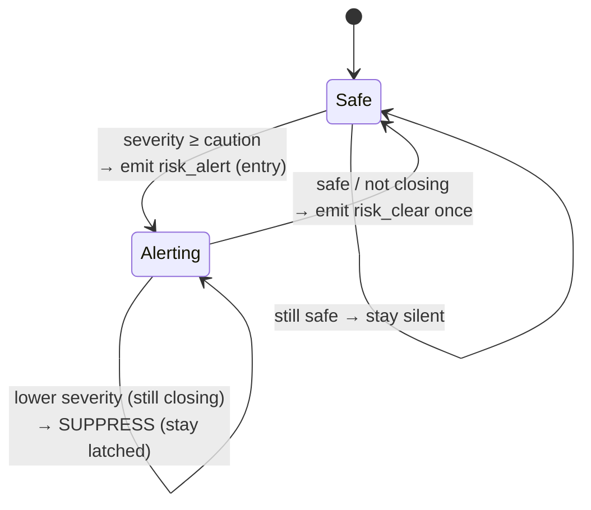

# VARTA — Risk Engine

The risk engine (`risk_engine.py`) is the product's brain. It turns a stream of raw
positions into a small number of **meaningful, non-annoying, explainable** alerts. This
document is the reference for how it decides _what_ to say and _when_ to say it.

Design goals, in priority order:

1. **Correctness of intent** — only warn about vehicles that are genuinely closing in.
2. **Explainability** — every alert carries a human-readable `reason` and a direction.
3. **No alert fatigue** — speak on escalation, stay quiet otherwise, and clean up after.
4. **Demo legibility** — the escalation must be slow enough for a human to narrate.

---

## 1. The loop

```python
while True:
    snapshot state under lock
    drop devices stale > 60s   (and their pair state)
    for each (pedestrian, vehicle) pair:
        process_pair(...)
    await asyncio.sleep(0.5)
```

Runs every **0.5 s**. Each tick evaluates every pedestrian↔vehicle pair independently.

---

## 2. Per-pair state

Because a real relationship evolves over time, each pair keeps a small memory
(`PairState`), keyed `"<pedestrian_id>__<vehicle_id>"`:

| Field              | Purpose                                                                  |
| ------------------ | ------------------------------------------------------------------------ |
| `last_distance`    | Previous distance — used to detect **closing** vs. receding              |
| `emitted_severity` | The **latched** severity for this episode (never downgraded until clear) |
| `last_emit_time`   | Cooldown anchor for same-severity refreshes                              |
| `critical_logged`  | Ensures a near-miss incident is written to DB **once** per episode       |

When either device goes stale, its pair state is discarded so a new encounter starts clean.

---

## 3. Signals computed each tick

For a pair, from the two latest frames:

- **Distance** — haversine, in metres.
- **Closing?** — `dist < last_distance - 0.3 m`. The `0.3 m` epsilon absorbs GPS
  jitter so we don't flip-flop. **First sighting is never "closing"** (no history yet),
  which prevents a spurious alert on the very first frame.
- **Time-to-conflict (TTC)** — `distance / (vehicle_speed + pedestrian_speed)`, a
  closing-speed heuristic. `null` when not closing.
- **Vehicle speed** — a vehicle must move `> 1.5 m/s` (~5.4 km/h) to count as a threat;
  parked/idling vehicles are ignored.

---

## 4. Severity mapping

Severity is **distance-band–driven** (interpretable, stable), and **escalated by TTC**
so a fast approach trips a higher level earlier than distance alone would.

| Severity   | Trigger (distance **or** TTC)                                 |
| ---------- | ------------------------------------------------------------- |
| `critical` | `dist ≤ 7 m` or `TTC ≤ 1.5 s`                                 |
| `warning`  | `dist ≤ 14 m` or `TTC ≤ 3.0 s`                                |
| `caution`  | `dist ≤ 24 m` or `TTC ≤ 5.0 s`                                |
| `safe`     | everything else, **or** not closing, **or** vehicle < 1.5 m/s |

> Distance bands (not raw score) drive the label because they're easy to reason about,
> easy to tune, and don't wobble frame-to-frame — which keeps the demo legible.

---

## 5. Risk score (the 0–100 gauge)

Severity is the _decision_; the score is a smooth _gauge_ for the UI. It's a weighted
blend of three normalized components:

```
distance_score = clamp(100 · (1 − distance / 28 m))
ttc_score      = 0 if not closing else clamp(100 · (1 − TTC / 8 s))
speed_score    = clamp(100 · speed_kmh / 35)

raw = 0.50·distance_score + 0.30·ttc_score + 0.20·speed_score
```

`raw` is then **clamped into the band of the current severity** so the number always
agrees with the label:

| Severity | Score band |
| -------- | ---------- |
| safe     | 0–40       |
| caution  | 45–64      |
| warning  | 65–84      |
| critical | 85–100     |

This resolves a real tension: to make the demo watchable we slow the vehicles down, but
slow vehicles would otherwise produce low raw scores. Anchoring the gauge to the
distance-driven band keeps the number climbing smoothly with the escalation.

---

## 6. Emission policy — say something only when it matters

This is what separates VARTA from a proximity buzzer. Given the current `severity` and
the pair's `emitted_severity`:



In words:

- **Entry** (`safe → caution/warning/critical`): emit a `risk_alert`.
- **Escalation** (severity increased): emit **immediately**, bypassing any cooldown —
  rising danger should never wait.
- **Same severity**: re-emit at most every **2.5 s** to refresh distance/TTC on screen.
- **De-escalation while still closing**: **suppressed**. Severity stays latched at its
  peak so the alert never flickers "critical → warning → critical" during an approach.
- **Clear** (`→ safe`, i.e. no longer closing or left the zone): emit exactly one
  `risk_clear`, then reset the pair to silent.

Net effect for one encounter: a clean **one caution, one warning, one critical, one
clear** — not a stream of dozens of buzzes.

---

## 7. Direction — relative to the pedestrian

Direction is computed as the bearing from pedestrian to vehicle, **rotated by the
pedestrian's heading**, then bucketed:

```
relative = (bearing_to_vehicle − pedestrian_heading) mod 360
front: 315–45°   right: 45–135°   back: 135–225°   left: 225–315°
```

So "front / back / left / right" mean _relative to where the pedestrian is facing_ —
not compass directions. This fixed an earlier bug where a scooter approaching head-on
was mislabeled as coming "from behind". If the pedestrian has no heading, we assume they
face north. Emitted both as a code (`front`) and a localized string
(`спереду`) inside the bracelet message.

---

## 8. Incident logging

When a pair first reaches **critical**, the engine fires a fire-and-forget task to
insert an `Incident` row (pedestrian, vehicle, lat/lon, distance). `critical_logged`
guarantees one row per episode — the basis for a future near-miss heatmap. DB failures
are swallowed so they can never take down the risk loop.

---

## 9. Worked example — the demo scenario

The emulator drives: pedestrian walking north at **0.4 m/s**, scooter approaching from
~**35 m** north at **3.0 m/s**, offset ~1.5 m so they pass side-by-side. Closing speed
≈ **3.4 m/s**.

| Time    | Distance | Severity     | What the pedestrian gets                        |
| ------- | -------- | ------------ | ----------------------------------------------- |
| ~0.0 s  | ~35 m    | safe         | (silence — nothing worth saying)                |
| ~3.5 s  | ~24 m    | **caution**  | first buzz + "Транспорт спереду (24 м)"         |
| ~6.5 s  | ~14 m    | **warning**  | stronger buzz, score climbs into 65–84          |
| ~8.5 s  | ~7 m     | **critical** | strongest buzz, incident logged once            |
| ~10.5 s | passing  | → **clear**  | `risk_clear`, console + bracelet return to idle |

Each phase lasts ~2–3 s — deliberately long enough to point at and narrate on stage.
De-escalation as the scooter recedes never produces a downgrade alert; the single
`risk_clear` ends the episode cleanly.

---

## 10. Tuning cheat-sheet

All knobs live at the top of `risk_engine.py`:

| Constant                              | Value                | Effect                                     |
| ------------------------------------- | -------------------- | ------------------------------------------ |
| `LOOP_INTERVAL_SECONDS`               | 0.5                  | Evaluation cadence                         |
| `CAUTION/WARNING/CRITICAL_DISTANCE_M` | 24 / 14 / 7          | Severity distance bands                    |
| `CAUTION/WARNING/CRITICAL_TTC_S`      | 5 / 3 / 1.5          | TTC escalation thresholds                  |
| `MIN_VEHICLE_SPEED_MPS`               | 1.5                  | Ignore parked/idling vehicles              |
| `CLOSING_EPSILON_M`                   | 0.3                  | Jitter tolerance for closing detection     |
| `REFRESH_INTERVAL_SECONDS`            | 2.5                  | Same-severity re-emit cadence              |
| `DISTANCE/TTC/SPEED` score refs       | 28 m / 8 s / 35 km/h | Gauge normalization                        |
| `STALE_DEVICE_SECONDS`                | 60                   | Drop silent devices (and their pair state) |

To make the escalation slower/faster for a room, change the emulator's speeds rather
than these thresholds — the thresholds encode the _safety model_, the emulator controls
the _pacing_ (see [`DEMO.md`](./DEMO.md)).
