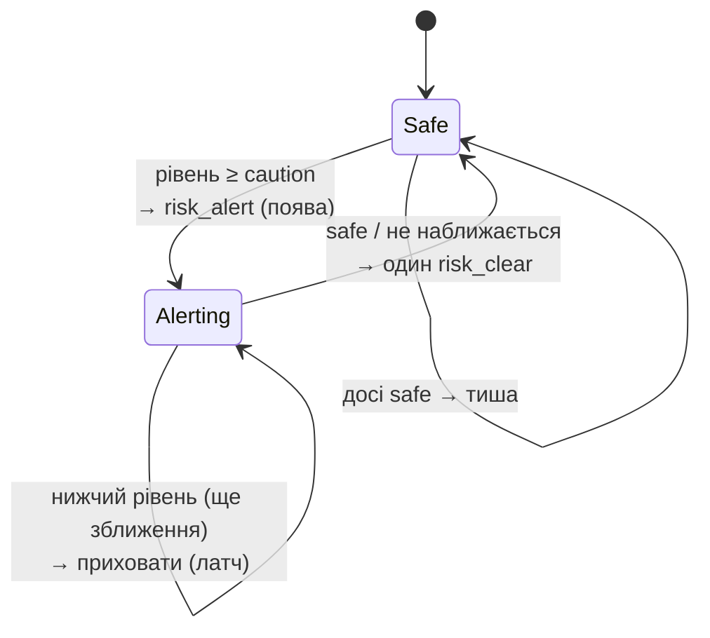

# VARTA – модуль оцінювання ризику

Модуль ризику (`risk_engine.py`) – це «мозок» системи. Він перетворює потік координат на невелику кількість **змістовних, ненав'язливих і пояснюваних** попереджень. Документ описує, _що_ саме система повідомляє і _коли_ вона це робить.

Пріоритети в порядку важливості:

1. **Правильність наміру** – попереджати лише про транспорт, який справді наближається.
2. **Пояснюваність** – кожне попередження має людиночитну причину `reason` і напрямок.
3. **Відсутність втоми від сповіщень** – повідомляти про зростання ризику, мовчати в решті випадків і коректно завершувати епізод.
4. **Помітність ескалації** – переходи між рівнями рознесені в часі так, щоб людина встигала сприйняти й відреагувати на кожен крок.

---

## 1. Цикл оцінювання

```text
поки працює застосунок:
    знімок стану під блокуванням
    прибрати пристрої, мовчазні понад 60 с (і стан їхніх пар)
    для кожної пари (пішохід, транспорт):
        обробити пару
    зачекати 0.5 с
```

Цикл виконується кожні **0.5 с** і на кожній ітерації незалежно оцінює всі пари «пішохід ↔ транспорт».

---

## 2. Стан пари

Оскільки реальна взаємодія розгортається в часі, кожна пара зберігає невелику пам'ять (`PairState`) з ключем `"<pedestrian_id>__<vehicle_id>"`:

| Поле               | Призначення                                                             |
| ------------------ | ----------------------------------------------------------------------- |
| `last_distance`    | Попередня відстань – для визначення зближення чи віддалення             |
| `emitted_severity` | **Зафіксований** (latched) рівень епізоду – не знижується до завершення |
| `last_emit_time`   | Опорний час для обмеження повторів того самого рівня                    |
| `critical_logged`  | Гарантує запис інциденту в БД **один раз** за епізод                    |

Коли будь-який із пристроїв стає неактивним, стан його пари скидається, тож нова взаємодія починається «з чистого аркуша».

---

## 3. Сигнали на кожному кроці

Для пари з двох останніх кадрів обчислюються:

- **Відстань** – за формулою гаверсинуса (haversine), у метрах.
- **Зближення?** – `dist < last_distance − 0.3 м`. Поріг `0.3 м` поглинає похибку GPS, щоб стан не «мерехтів». Перша поява пари ніколи не вважається зближенням (немає історії), що виключає хибне попередження на першому кадрі.
- **Час до конфлікту (TTC)** – `відстань / (швидкість_транспорту + швидкість_пішохода)`, евристика (heuristic) за швидкістю зближення. Дорівнює `null`, якщо зближення немає.
- **Швидкість транспорту** – транспорт має рухатися швидше за `1.5 м/с` (~5.4 км/год), щоб вважатися загрозою; припарковані чи повільні об'єкти ігноруються.

---

## 4. Рівні небезпеки

Рівень визначається насамперед **діапазоном відстані** (зрозуміло й стабільно) і **посилюється за TTC**, тож швидке наближення спрацьовує на вищий рівень раніше, ніж це зробила б сама відстань.

| Рівень     | Умова (відстань **або** TTC)                                   |
| ---------- | -------------------------------------------------------------- |
| `critical` | `dist ≤ 7 м` або `TTC ≤ 1.5 с`                                 |
| `warning`  | `dist ≤ 14 м` або `TTC ≤ 3.0 с`                                |
| `caution`  | `dist ≤ 24 м` або `TTC ≤ 5.0 с`                                |
| `safe`     | усе інше, **або** немає зближення, **або** швидкість < 1.5 м/с |

Рівень визначає саме діапазон відстані, а не «сирий» скор: діапазони легко пояснити й налаштувати, і вони не коливаються від кадру до кадру.

---

## 5. Ризик-скор (шкала 0–100)

Рівень – це _рішення_; скор – це плавна _шкала_ для інтерфейсу. Він є зваженою сумою трьох нормалізованих складових:

```text
distance_score = clamp(100 · (1 − відстань / 28 м))
ttc_score      = 0, якщо немає зближення, інакше clamp(100 · (1 − TTC / 8 с))
speed_score    = clamp(100 · швидкість_км/год / 35)

raw = 0.50·distance_score + 0.30·ttc_score + 0.20·speed_score
```

Далі `raw` **обмежується діапазоном поточного рівня**, тож число завжди узгоджене з міткою:

| Рівень   | Діапазон скору |
| -------- | -------------- |
| safe     | 0–40           |
| caution  | 45–64          |
| warning  | 65–84          |
| critical | 85–100         |

Це знімає реальне протиріччя: у демо транспорт рухається з помірною, реалістичною швидкістю, і сам по собі «сирий» скор був би низьким навіть за кілька метрів до пішохода. Прив'язка шкали до діапазону рівня тримає число узгодженим з міткою й плавно зростаючим під час ескалації.

---

## 6. Політика генерації подій

Саме ця політика (emission policy) відрізняє VARTA від простого датчика близькості. Залежно від поточного `severity` та зафіксованого `emitted_severity`:



Словами:

- **Поява** (`safe → caution/warning/critical`): надсилається `risk_alert`.
- **Ескалація** (рівень зріс): надсилається **негайно**, в обхід будь-якого обмеження частоти – зростання небезпеки не має чекати.
- **Той самий рівень**: повторюється не частіше ніж раз на **2.5 с**, щоб оновити відстань і TTC на екрані.
- **Зниження рівня під час зближення**: **приховується**. Рівень лишається зафіксованим на піку, щоб попередження не «мерехтіло» critical → warning → critical.
- **Завершення** (`→ safe`, тобто транспорт минув або більше не наближається): надсилається рівно один `risk_clear`, після чого пара повертається до тиші.

Підсумок для одного епізоду: чіткі **один caution, один warning, один critical, один clear** – а не десятки вібросигналів.

---

## 7. Напрямок – відносно пішохода

Напрямок обчислюється як азимут від пішохода до транспорту, **повернутий на напрямок руху пішохода**, і далі розкладається на сектори:

```text
відносний = (азимут_до_транспорту − напрямок_пішохода) mod 360
front: 315–45°   right: 45–135°   back: 135–225°   left: 225–315°
```

Тож «спереду / позаду / ліворуч / праворуч» означають напрямок _відносно того, куди рухається пішохід_, а не сторони світу. Якщо в пішохода немає напрямку, вважаємо, що він орієнтований на північ. Напрямок передається і як код (`front`), і як локалізований рядок (`спереду`) у повідомленні браслета.

---

## 8. Журналювання інцидентів

Коли пара вперше досягає рівня **critical**, модуль запускає фонову задачу (background task), що вставляє рядок `Incident` (пішохід, транспорт, координати, відстань). Прапорець `critical_logged` гарантує один запис на епізод – основу для майбутньої карти небезпечних зближень. Помилки БД поглинаються, тож вони ніколи не зупиняють цикл ризику.

---

## 9. Приклад сценарію

Емулятор задає: пішохід рухається на північ зі швидкістю **0.4 м/с**, самокат наближається з півночі з ~**35 м** зі швидкістю **3.0 м/с**, із боковим зміщенням ~1.5 м, тож вони розминаються поруч. Швидкість зближення ≈ **3.4 м/с**.

| Час     | Відстань | Рівень       | Що отримує пішохід                                    |
| ------- | -------- | ------------ | ----------------------------------------------------- |
| ~0.0 с  | ~35 м    | safe         | тиша – немає про що повідомляти                       |
| ~3.5 с  | ~24 м    | **caution**  | перша вібрація + «Транспорт спереду (24 м)»           |
| ~6.5 с  | ~14 м    | **warning**  | сильніша вібрація, скор зростає до 65–84              |
| ~8.5 с  | ~7 м     | **critical** | найсильніша вібрація, інцидент записано один раз      |
| ~10.5 с | минає    | → **clear**  | `risk_clear`, консоль і браслет повертаються в спокій |

Кожна фаза триває ~2–3 с – достатньо, щоб людина сприйняла й відреагувала на кожен крок. Віддалення самоката не породжує попередження про зниження рівня; епізод завершує один `risk_clear`.

---

## 10. Чому саме такі значення

Константи задають просту модель безпеки, а не довільне підлаштування. Нижче – обґрунтування кожної групи.

### 10.1 Діапазони відстані – `24 / 14 / 7 м`

Діапазони підібрані так, щоб кожен давав пішоходу співмірний _запас часу_ за типової швидкості мікромобільності (~4–7 м/с, тобто ~15–25 км/год):

| Рівень   | Відстань | Запас часу за 4–7 м/с | Намір                                                      |
| -------- | -------- | --------------------- | ---------------------------------------------------------- |
| caution  | 24 м     | ~3.5–6 с              | «зверни увагу» – встигнути підняти погляд і знайти джерело |
| warning  | 14 м     | ~2–3.5 с              | «дій зараз» – почати зміщуватися з траєкторії              |
| critical | 7 м      | ~1–1.7 с              | «останній шанс» – близько до межі часу реакції людини      |

Діапазони рознесені приблизно геометрично (24 → 14 → 7, крок ≈ 1.7–2×), тож кожне наступне кільце додає співмірний приріст часу, а не «злипається» з попереднім. Поріг `7 м` як критичний відповідає межі, після якої повільна реакція майже не лишає простору для уникнення – саме тому цей рівень ще й фіксує інцидент.

### 10.2 Пороги TTC – `5 / 3 / 1.5 с`

Сама відстань недооцінює швидке наближення, тому час до конфлікту підвищує рівень незалежно. Пороги відповідають відомим орієнтирам часу реакції:

- **1.5 с (critical)** ≈ практична межа часу сприйняття й реакції людини.
- **3 с (warning)** ≈ типове «дій зараз», що використовують як мінімальний безпечний інтервал.
- **5 с (caution)** ≈ горизонт ранньої уваги: достатньо далеко, щоб це було підказкою, і достатньо близько, щоб це мало значення.

Оскільки рівень = `max(діапазон_відстані, діапазон_TTC)`, швидкий самокат за 20 м, який стрімко наближається, підвищується до warning/critical ще до входу у вужчі кільця відстані.

### 10.3 Пороги фільтрації – `MIN_VEHICLE_SPEED 1.5 м/с`, `CLOSING_EPSILON 0.3 м`

- **`MIN_VEHICLE_SPEED_MPS = 1.5`** (~5.4 км/год) трохи вище за швидку ходу. Нижче цього «транспорт» припаркований, стоїть або «дрейфує» через похибку GPS – це не динамічна загроза, тож ігнорується. Це найбільший фільтр хибних спрацювань (false positives).
- **`CLOSING_EPSILON_M = 0.3`** – «мертва зона» (dead-band) для тесту зближення. За 0.5 с транспорт, що справді наближається зі швидкістю ~3 м/с, проходить ~1.5 м – значно більше за 0.3 м, тоді як покадрове тремтіння GPS помітно менше. Тож `0.3 м` відділяє реальне наближення від шуму без відчутної затримки.

### 10.4 Ваги й нормалізація скору – `0.5 / 0.3 / 0.2` за `28 м / 8 с / 35 км/год`

- **Ваги `0.5 відстань · 0.3 TTC · 0.2 швидкість`.** Відстань домінує як найнадійніший і найзрозуміліший сигнал; TTC – другий за значенням, бо враховує _динаміку_; швидкість – невеликий доданок, що відображає «силу» можливого удару. Сума дорівнює 1, тож скор лишається в межах 0–100.
- **`DISTANCE_SCORE_RANGE_M = 28`** трохи більше за діапазон caution (24 м), тож складова відстані ≈ 0 саме тоді, коли транспорт поза зоною попереджень, і плавно зростає при вході в кільця.
- **`TTC_SCORE_HORIZON_S = 8`** трохи більше за поріг caution TTC (5 с), тож складова TTC починає впливати ще до першого попередження.
- **`SPEED_SCORE_REF_KMH = 35`** близько до верхньої межі реалістичної швидкості самоката/велосипеда, тож звичайні швидкості дають помітну, але не насичену частку шкали.

Далі «сира» сума обмежується діапазоном поточного рівня (розділ 5), тож число ніколи не суперечить мітці.

### 10.5 Часові константи – `LOOP 0.5 с`, `REFRESH 2.5 с`, `STALE 60 с`

- **`LOOP_INTERVAL_SECONDS = 0.5`** збігається з частотою телеметрії: достатньо швидко для субсекундної реакції й дешево, щоб щоразу оцінювати всі пари.
- **`REFRESH_INTERVAL_SECONDS = 2.5`** – частота повтору того самого рівня: достатньо часто, щоб відстань і TTC на екрані лишалися свіжими, і достатньо рідко, щоб не було потоку вібросигналів.
- **`STALE_DEVICE_SECONDS = 60`** прибирає пристрої (і стан їхніх пар), що мовчать хвилину. Це очищає сцену й тримає оперативний стан тимчасовим.

---

## 11. Параметри для налаштування

Усі «ручки» зібрано у верхній частині `risk_engine.py`:

| Константа                              | Значення               | Вплив                                            |
| -------------------------------------- | ---------------------- | ------------------------------------------------ |
| `LOOP_INTERVAL_SECONDS`                | 0.5                    | Частота оцінювання                               |
| `CAUTION/WARNING/CRITICAL_DISTANCE_M`  | 24 / 14 / 7            | Діапазони відстані для рівнів                    |
| `CAUTION/WARNING/CRITICAL_TTC_S`       | 5 / 3 / 1.5            | Пороги TTC для підвищення рівня                  |
| `MIN_VEHICLE_SPEED_MPS`                | 1.5                    | Ігнорування припаркованого/повільного транспорту |
| `CLOSING_EPSILON_M`                    | 0.3                    | Допуск на похибку при визначенні зближення       |
| `REFRESH_INTERVAL_SECONDS`             | 2.5                    | Частота повтору того самого рівня                |
| `DISTANCE/TTC/SPEED` – опорні значення | 28 м / 8 с / 35 км/год | Нормалізація шкали скору                         |
| `STALE_DEVICE_SECONDS`                 | 60                     | Видалення мовчазних пристроїв і стану пар        |

Щоб зробити ескалацію повільнішою чи швидшою, змінюйте швидкості й позиції у сценарії емулятора (`emulator.py`), а не ці пороги: пороги кодують _модель безпеки_, а сценарій керує _темпом_ (див. [`DEMO.md`](./DEMO.md)).
